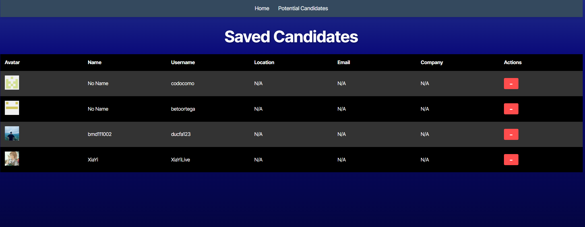

# Candidate Search

## Description
This project allows users to search for potential candidates from GitHub based on various criteria. Users can view detailed information about candidates, such as their name, username, location, email, company, and GitHub profile link. Additionally, users can save candidates to a list and remove them if needed.

## Table of Contents
- [Installation](#installation)
- [Usage](#usage)
- [License](#license)
- [Contributing](#contributing)
- [Tests](#tests)
- [Questions](#questions)

## Installation
To install, run 'npm install' in the terminal.

## Usage
After installing, run 'npm run build' followed by 'npm run dev' to run locally or visit the deployed site [here](https://candidate-search-f8k8.onrender.com/). On the website you can view GitHub users and decide to skip the candidate or save the candidate in local storage.

## License
This project is licensed under the MIT license.  
For more details, please refer to the [MIT License](https://opensource.org/licenses/MIT).
  

## Contributing
If you'd like to contribute, fork the repository and submit a pull request.

## Tests
No specific test instructions for this project.

## Questions
If you have any questions, please feel free to reach out:
- GitHub: [JPMill](https://github.com/JPMill)
- Email: [justinmiller617@gmail.com](mailto:justinmiller617@gmail.com)
